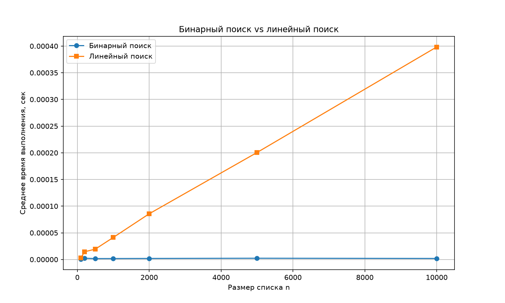

# Лабораторная работа: Массивы и бинарный поиск

## Цель
Изучить массивы, реализовать бинарный поиск и сравнить его с линейным поиском.

## Реализация
- `binary_search.py` — функции `binary_search` и `linear_search`.
- `task_03.py` — генерация 100 чисел и проверка поиска.
- `experiments.py` — сравнение скорости и построение графика.

## Анализ сложности
Бинарный поиск:
- время: O(log n);
- память: O(1);
- требует отсортированный массив.

Линейный поиск:
- время: O(n);
- память: O(1);
- не требует сортировки.

## Результаты для 100 чисел
Вставьте сюда вывод `task_03.py`.

## Сравнение скорости
Вставьте сюда таблицу из `experiments.py`.

## Вывод
Бинарный поиск значительно быстрее линейного на больших списках,
но работает только с отсортированными данными.